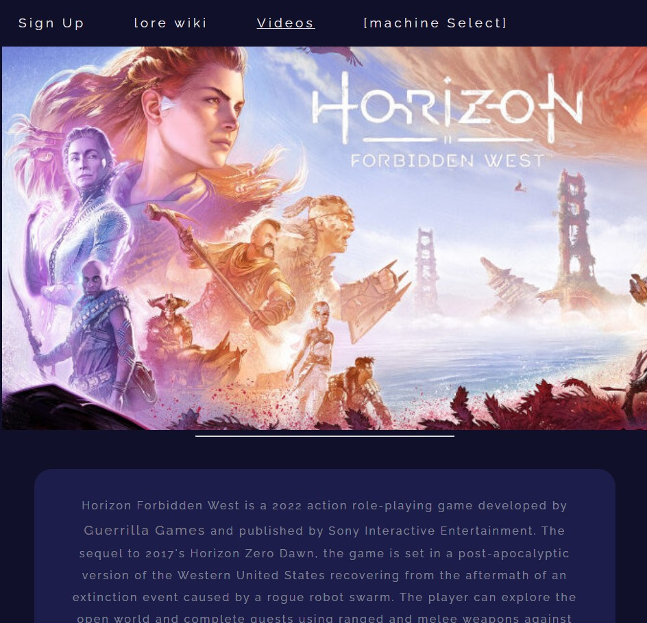

# Horizon Site Project
```
 This Horizon site project Webpage was made as a starting guide in my early software development role.   This guide allowed me to implement the foundations of HTML, CSS, and Git as I learned it while leaving reminders of what was learned though out the process.  As a fan of the Horizon games, my goal was to challenge myself creatively and create a functional site anyone can interact with.  

```

- [Installation](#N/A)
- [Usage](#Usage)
- [Credits](#credits)
- [License](#license)

## Installation

No installation needed.

## Usage

This webpage contains HTML, CSS, Git version control.  If you open the devTools in you web browser, you can inspect the JavaScript running.  HTML was learned first to structure the page.  CSS was implemented to style the content.  JavaScript allow the page to function when the page displayed.  Git was used to save and then pushed to Git Hub.  I intend to update this site thoughout my learning process.

## I have included an image of the site and a link below!

https://aaronf87.github.io/HorizonFansite/



## Credits

N/A

## License

The last section of a high-quality README file is the license. This lets other developers know what they can and cannot do with your project. If you need help choosing a license, refer to [https://choosealicense.com/](https://choosealicense.com/).
